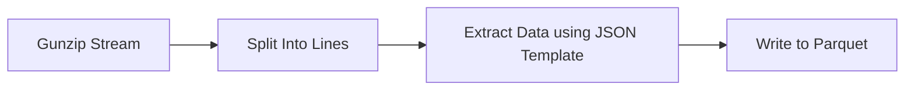

# arrow-gh-processor

This project illustrates how to build a data processor using a Go, Apache Arrow. This code reads the JSON lines data provided in compressed archives by GitHub and extracts events by type and stores them in a parquet file.

# Overview

Currently this project extracts events of type `PullRequestEvent` and writes them out to parquet, the process looks something like this.



# Usage

```
Usage: arrow-gh-processor <source> <destination>

Arguments:
  <source>         Source github archive file containing JSON and compressed with Gzip
  <destination>    Destination parquet output file

Flags:
  -h, --help                             Show context-sensitive help.
      --version
      --event-type="PullRequestEvent"
```

# Example

Download an archive from the GitHub archive website.

```
curl -L -O https://data.gharchive.org/2023-06-26-14.json.gz
```

Convert it to parquet.

```
arrow-gh-processor 2023-06-26-14.json.gz 2023-06-26-14.snappy.parquet
```

The schema of the output parquet file will be as follows.

```
repeated group field_id=-1 arrow_schema {
  optional byte_array field_id=-1 id (String);
  optional byte_array field_id=-1 type (String);
  optional byte_array field_id=-1 actor (String);
  optional byte_array field_id=-1 actor_url (String);
  optional byte_array field_id=-1 repo (String);
  optional byte_array field_id=-1 repo_url (String);
  optional byte_array field_id=-1 pull_action (String);
  optional int64 field_id=-1 pull_number (Int(bitWidth=64, isSigned=true));
  optional byte_array field_id=-1 pull_state (String);
  optional byte_array field_id=-1 pull_title (String);
  optional byte_array field_id=-1 author_association (String);
  optional int64 field_id=-1 created_at (Timestamp(isAdjustedToUTC=true, timeUnit=milliseconds, is_from_converted_type=false, force_set_converted_type=true));
  optional byte_array field_id=-1 pull_request (String);
}
```

Query the data using [duckdb](https://duckdb.org/).

```sql
SELECT actor, count(id) 
FROM read_parquet('2023-06-26-14.snappy.parquet') 
GROUP BY actor ORDER BY count(id) desc;
```

Output will look something like.

```
duckdb
v0.8.1 6536a77232
Enter ".help" for usage hints.
Connected to a transient in-memory database.
Use ".open FILENAME" to reopen on a persistent database.
D SELECT actor, count(id) FROM read_parquet('2023-06-26-14.snappy.parquet') GROUP BY actor ORDER BY count(id) desc;
┌───────────────────────────┬───────────┐
│           actor           │ count(id) │
│          varchar          │   int64   │
├───────────────────────────┼───────────┤
│ dependabot[bot]           │      2392 │
│ pull[bot]                 │       538 │
│ renovate[bot]             │       511 │
│ github-actions[bot]       │       278 │
│ direwolf-github           │       101 │
│ trunk-dev[bot]            │        81 │
````

# License

This project is released under Apache 2.0 license and is copyright [Mark Wolfe](https://www.wolfe.id.au).